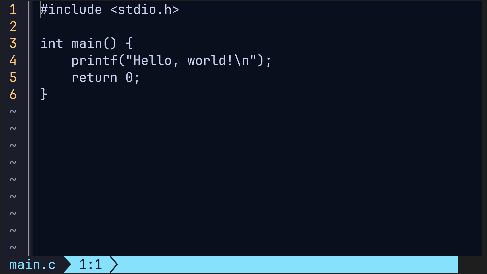

# `tinye`

a lightweight, non-modal, keyboard-driven, terminal-based code editor written in Rust

## preview



## installation

```bash
cargo install --git https://github.com/tayenx3/tinye.git

# verify installation
tinye --version
```

(you can install cargo at [rustup.rs](https://rustup.rs))

## features

### the command palette

`tinye` is very minimalistic and delegated. its power remains in the command palette (Ctrl+Shift+P)

any CLI tool that doesn't expect input from stdin can be ran with `tm command [args]`
and `tinye` will write the stdout to `<command-name>_out.txt` and the stdout to `<command-name>_err.txt`

so instead of making a search feature, you can do `tm cat -n foo.txt | grep "bar"` (or `tm findstr /n "bar" foo.txt` on Windows)
and then `st grep_out.txt` (or `st findstr_out.txt`)

`tinye`'s main philosophy is *"why do \[X\] when \[Y\], which can do the same and is battle-tested, is within reach?"*

### commands

the only commands `tinye` provides in the command palette are:

- `tm <command>` - spawns a child process for `command` and show the stdout/stderr (without saving the current buffer)
- `switchto/st <file> [path]` - save the current buffer and load `file`
- `switchnosave/sns <file>` - same as `st` but discards the current changes
- `savefile/sf [path]` - write the current buffer to the save path *(warning: will do nothing if save path is not supplied)*
- `return/ret [path]` - save the current buffer load the last opened file before the current file *(warning: will do nothing if save path is not supplied)*
- `returnnosave/rns` - same as `ret` but discards the current changes

(arguments wrapped in `<...>` are required while arguments wrapped in `\[...\]` are not)

you can define your own commands by making a `.tinyeconfig` file and writing:

```
# comment

commands:
  command0 ..args: ...
  command1 ..args: ...
```

here's an example:

```
commands:
  cc $inp(str) $out(str): tm gcc $inp -o $out
  cc $inp(str): cc $inp target/a.exe
  ccall: cc src/*.c target/main.exe
```
